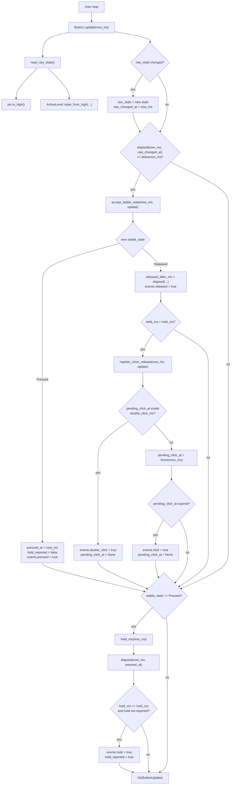
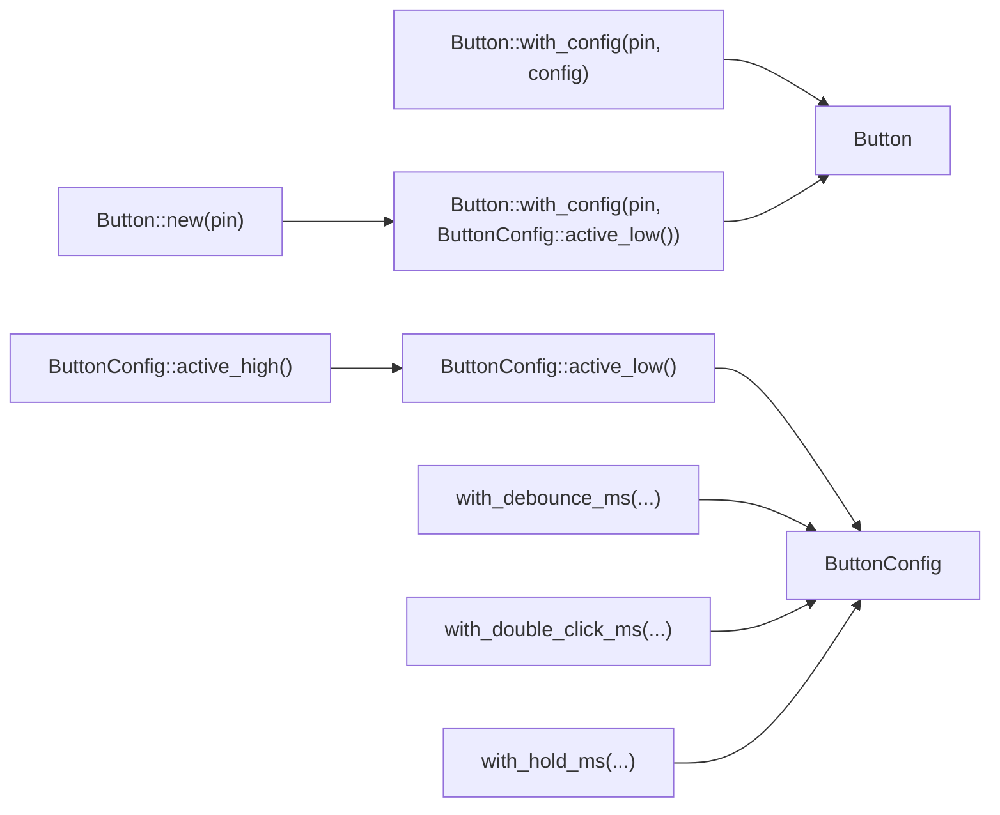

# debounce-button-eng

`debounce-button-eng` is a `no_std` crate for handling a mechanical button
through `embedded-hal::digital::InputPin`.

The crate is not tied to a specific microcontroller or timer. The application
passes monotonic time in milliseconds, while the crate filters contact bounce
and returns the stable button state plus short event flags.

This crate is an English-language duplicate of `debounce-button`.

## Features

- configurable debounce time;
- `active-low` and `active-high` buttons;
- stable `Pressed` / `Released` state;
- `pressed` and `released` events;
- single click;
- double click;
- hold event;
- current and final hold duration;
- tests based on `embedded-hal-mock`.

## Installation

For local use as a path dependency:

```toml
[dependencies]
debounce-button-eng = { path = "../debounce-button-eng" }
```

If the crate is published to crates.io, the dependency can be written by
version:

```toml
[dependencies]
debounce-button-eng = "0.1"
```

## Quick Start

A typical button is wired between a GPIO pin and ground while the input uses a
pull-up resistor. In that case the pressed state is logical `Low`, so use
`ButtonConfig::active_low()`.

```rust,ignore
use debounce_button_eng::{Button, ButtonConfig};

let config = ButtonConfig::active_low()
    .with_debounce_ms(20)
    .with_double_click_ms(300)
    .with_hold_ms(1_000);

let mut button = Button::with_config(input_pin, config);

loop {
    let now_ms = monotonic_millis();
    let update = button.update(now_ms)?;

    if update.events.pressed {
        // The button was pressed.
    }

    if update.events.released {
        // The button was released.
    }

    if update.events.click {
        // A single click was confirmed.
    }

    if update.events.double_click {
        // A double click was completed.
    }

    if update.events.hold {
        // The button was held for at least hold_ms.
    }
}
```

`input_pin` must implement `embedded_hal::digital::InputPin`.

## Time

`Button::update(now_ms)` accepts monotonic time in milliseconds. Monotonic time
is a counter that only moves forward, for example milliseconds since MCU boot.

Correct:

```rust,ignore
button.update(100)?;
button.update(105)?;
button.update(120)?;
```

Incorrect:

```rust,ignore
button.update(100)?;
button.update(80)?; // time moved backwards
```

The crate uses differences between timestamps to determine:

- how long the input has been stable after a raw change;
- when a new state can be accepted after debounce;
- how long the button has been held;
- whether the second click landed inside the double-click window.

## Configuration

```rust,ignore
let config = ButtonConfig::active_low()
    .with_debounce_ms(20)
    .with_double_click_ms(300)
    .with_hold_ms(1_000);
```

Configuration fields:

- `debounce_ms` - how many milliseconds the raw pin state must remain stable
  before it becomes the debounced state;
- `double_click_ms` - maximum interval between two short clicks;
- `hold_ms` - hold threshold;
- `active_level` - electrical level that represents a pressed button.

For a button that is pressed when the input is high:

```rust,ignore
let config = ButtonConfig::active_high();
```

Timings can be changed at runtime:

```rust,ignore
button.set_debounce_ms(30);
button.set_double_click_ms(250);
button.set_hold_ms(1_500);
```

## Events

`Button::update` returns `ButtonUpdate`:

```rust,ignore
let update = button.update(now_ms)?;
```

Main fields:

- `update.state` - current stable button state;
- `update.events.pressed` - the stable state changed to `Pressed`;
- `update.events.released` - the stable state changed to `Released`;
- `update.events.click` - a single short click was confirmed after the
  `double_click_ms` window expired;
- `update.events.double_click` - two short clicks completed inside the
  `double_click_ms` window;
- `update.events.hold` - the hold threshold was reached;
- `update.held_ms` - how many milliseconds the button is currently held;
- `update.released_after_ms` - how many milliseconds the button was held before
  it was released.

`events.hold` fires once per hold. If you need the continuously updated hold
time, read `held_ms`.

`events.click` is intentionally delayed until the `double_click_ms` window
expires. Without this delay, a double click would first emit a single `click`
and then a `double_click`. The first short release is now stored as a pending
click. If the second short click arrives in time, only `double_click` is
emitted. If no second click arrives, the pending click becomes `click`.

## How `Button::update` Works

`update(now_ms)` is the crate's main function. Call it regularly from the main
loop, an RTOS task, or a timer. Each call reads the pin once, updates internal
state, and returns `ButtonUpdate`.

```rust,ignore
let update = button.update(now_ms)?;
```

Important: `update` does not wait internally. It does not call `delay` and does
not block the program during debounce. Filtering happens across repeated calls
with fresh `now_ms` values.

Internal state:

- `raw_state` - latest physical pin state after applying `active_low` or
  `active_high`;
- `raw_changed_at` - time when `raw_state` last changed;
- `stable_state` - state that has already passed debounce filtering;
- `pressed_at` - time when the stable state became `Pressed`;
- `pending_click_at` - time of a short release that is waiting to become either
  a single `click` or part of a `double_click`;
- `hold_reported` - whether `hold` has already been emitted for the current
  hold.

One `update(now_ms)` call works like this:

1. Read the pin through `pin.is_high()`.
2. Convert the electrical level to `ButtonState`.
   For `active_low`: `Low -> Pressed`, `High -> Released`.
3. If the new raw state differs from the previous `raw_state`, store it and
   restart the debounce timer:

   ```text
   raw_state = new state
   raw_changed_at = now_ms
   ```

   No `pressed` or `released` event is created yet.

4. If `raw_state` differs from `stable_state`, check how long the raw state has
   stayed unchanged:

   ```text
   now_ms - raw_changed_at >= debounce_ms
   ```

5. Only then is the raw state accepted as the new stable state. This is where
   `pressed` or `released` events appear.
6. When the stable state becomes `Pressed`, store `pressed_at = now_ms`.
7. When the stable state becomes `Released`, compute
   `released_after_ms = now_ms - pressed_at`.
8. If the release happened before `hold_ms`, it is a short-click candidate. It
   is stored in `pending_click_at`; `events.click` is not emitted yet.
9. If a second short click completes within `double_click_ms`, emit
   `events.double_click` and clear the pending single click.
10. If the second click does not arrive before `double_click_ms` expires, emit
    `events.click`.
11. While the button remains stably pressed, compute `held_ms`.
12. When `held_ms >= hold_ms`, emit `events.hold` once for the hold.

Example with `debounce_ms = 20`, active-low button:

```text
now_ms   pin   raw_state   stable_state   event
0        High  Released    Released       -
10       Low   Pressed     Released       raw changed, wait for debounce_ms
25       Low   Pressed     Released       only 15 ms elapsed, too early
30       Low   Pressed     Pressed        events.pressed = true
80       High  Released    Pressed        raw changed, wait for debounce_ms
95       High  Released    Pressed        only 15 ms elapsed, too early
100      High  Released    Released       events.released = true, click waits for double_click_ms
301      High  Released    Released       events.click = true
```

The important rule is that an event is not produced when the physical pin first
changes. It is produced only after the new state has remained stable for at
least `debounce_ms`.

`ButtonUpdate` describes the current call only:

- `state` stores the current stable state and persists between calls;
- `events.*` are short one-call pulses;
- `held_ms` is present only while the button is stably pressed;
- `released_after_ms` is present only in the call that stably released the
  button.

If `pin.is_high()` returns an error, `update` returns `Err(...)` immediately.
Internal state is not updated in that case.

Calling `update` more often gives more precise event timing. A 1-10 ms polling
period is usually convenient. Slower polling still keeps the logic correct, but
events can be delayed by up to the polling period.

## Function Call Flow

The main path starts in the user loop that regularly calls
`Button::update(now_ms)`.



The same flow as a list:

1. `Button::update(now_ms)` reads the physical pin through `read_raw_state()`.
2. `read_raw_state()` calls `pin.is_high()` and maps the level to `ButtonState`
   through `ActiveLevel::state_from_high(...)`.
3. If the raw state changed, `update` stores the new raw state and
   `raw_changed_at`.
4. If the raw state has been stable for at least `debounce_ms`,
   `accept_stable_state(...)` is called.
5. A transition to `Pressed` emits `events.pressed` and stores `pressed_at`.
6. A transition to `Released` emits `events.released`, computes
   `released_after_ms`, and calls `register_short_release(...)` for a short
   press.
7. `register_short_release(...)` either confirms `events.double_click` if the
   previous short release was inside `double_click_ms`, or stores a new pending
   single click.
8. If the pending single click lives longer than `double_click_ms`, `update`
   emits `events.click`.
9. If the stable state is currently `Pressed`, `update` computes `held_ms`.
10. When `held_ms >= hold_ms`, `events.hold` is emitted once for the hold.

Constructors and configuration:



## Tests

Run library tests:

```powershell
cargo test
```

Check formatting and clippy:

```powershell
cargo fmt --check
cargo clippy --all-targets -- -D warnings
```
